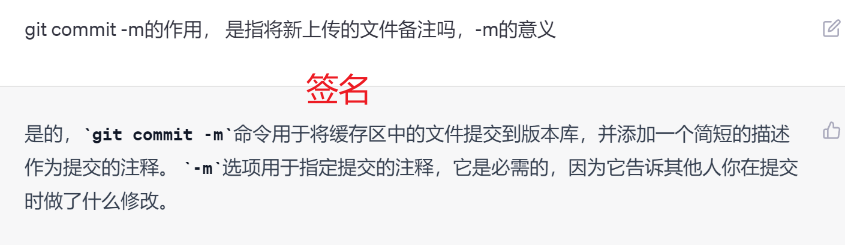
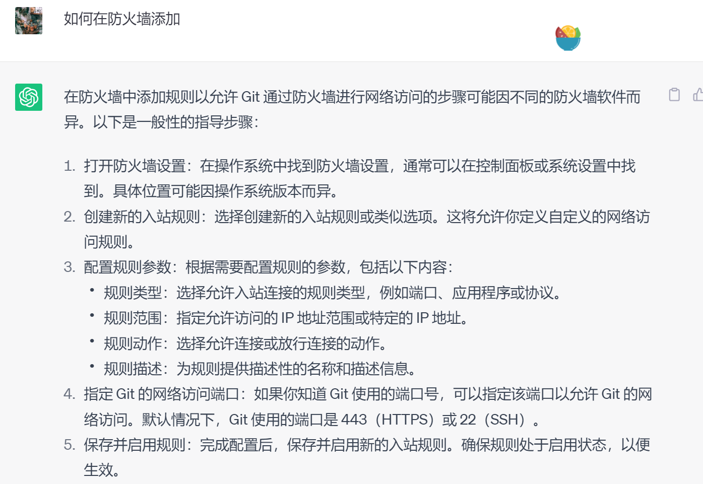
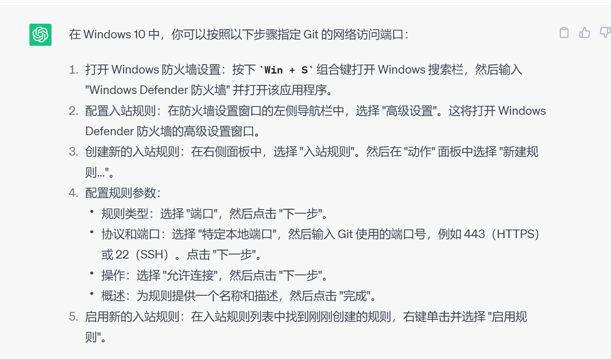
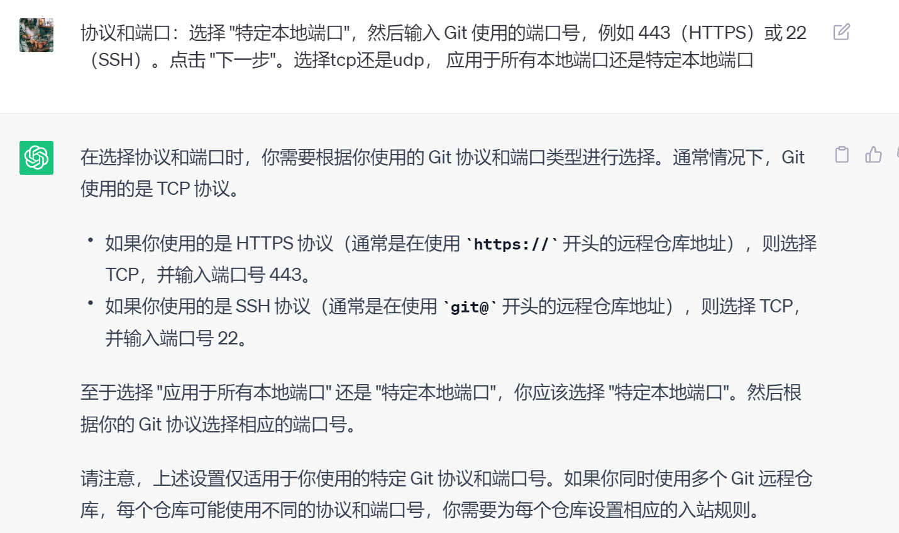

4.19 16：00 - 21： 00 数据整合

# Git Bash

​	**含义：** Git Bash 是在 Windows 操作系统上运行 Git 命令的一种**终端模拟器**，它提供了一种在 Windows 中使用 **Bash Shell（Unix Shell）的方式**，可以在 Windows 下使用类 Unix Shell 的命令行语法操作 Git。它使用的是 Git for Windows 版本，其中包含了 **Git 命令行工具和 Git GUI 工具**，并且还包含了 Bash Shell 环境，可以在 Windows 中使用 Bash Shell 命令行操作 Git。

​	Git Gui 可视化操作图形工具，通过**鼠标点击选择**，即可将文件上传到远程仓库

Git Bash 是一个很好的工具，因为它提供了一个更为熟悉的 Linux / Unix 命令行环境，让 Windows 用户可以更方便地使用 Git 命令

### Git Bash工具的汉化

​	

​	GitBash  在界面**右键即可选择汉化**


GitGui,需要**下载汉化包 zh_cn_msg**，并将汉化包放到msgs文件下（手动生成放于../lib目录xia）

**汉化包下载地址：** https://gitcode.net/mirrors/stayor/git-gui-zh/-/blob/master/zh_cn.msg


## 本地仓库与远程仓库的连接


1. **在GitHub上建立一个新的仓库**

2. **将本地仓库初始化**

   所要进行连接的本地仓库（某个目录），在地址栏 cmd进去该目录

   在window终端执行命令   **git init** ，会在该目录下生成**.git隐藏文件**  标识初始化成功

   ​	在初始化时，可能由于版本不同，将分支命名为 master，需要重新以main命名分支，否则使后	面git pull失败

3. **与远程仓库建立连接：** 

   **git remote add origin GitHub 仓库的 URL** （不加[ ]，此语句将url（远程仓库）命名为**origin**,origin代表的为 URL地址， 加[ ] 后面上传时 使用 origin失败，不会解析符号内 内容）

4. **建立成功后便可进行数据的传输**

   将本地 Git 仓库中所有未跟踪的文件添加到 Git 索引中

   ​	**git add .**

   将文件提交到本地 Git 仓库，使用以下命令（请将 "commit message" 替换为您的提交消息）,提交的描述，又名为签名（可在描述中告诉本人做了的修改）

   ​	**git commit -m "commit message"**     **-m必写**

   

   将本地 Git 仓库的提交推送到 GitHub 远程仓库中的 `main` 分支

   ​	**git push -u origin main** ， 此句原为git push -u origin main(远程仓库的main分支) 	main(本地仓库的main分支)

   因为名字相同故可以省略为如上语句


## 一些语句

git branch  检测当时所在分支  

git branch main 如果main分支不在 则创建

git remote -v  显示所连接的远程仓库

git checkout [branch name]（分支名）  切换到所要切换的分支

git remote remove origin  取消连接

git reset 将缓冲区的内容去除

​	git reset <file> 撤销更改的文件名


# 知识点

### main分支

本地仓库的主分支（默认为 `main` 分支）是一个指向您项目根目录下的所有文件和子目录的指针。在 Git 中，每次提交更改时，都会创建一个新的提交对象，该对象包含对文件和目录所做更改的描述。每个提交对象都有一个指向其父提交对象的指针，这样就可以形成一个提交历史记录链。

当您在本地仓库上创建 `main` 分支时，Git 会将其指向当前工作目录中的所有文件和子目录。在此之后，当您提交更改时，`main` 分支指针将指向新的提交对象。因此，`main` 分支是一个指向整个项目根目录下的所有文件和子目录的指针。

需要注意的是，Git 仓库中的子目录和文件并不是自动包含在版本控制中的。您需要显式地将它们添加到 Git 仓库中，以便它们的更改能够被跟踪和提交。使用 `git add` 命令可以将文件或目录添加到 Git 仓库中。

希望这个解释可以帮助您理解本地仓库的主分支是如何指向项目根目录下的所有文件和子目录的。


### 为什么本地分支默认为master不为main

在 Git 的早期版本中，`master` 是默认的主分支名称，因此很多人在创建 Git 仓库时都会使用 `master` 分支。但是在 2020 年，GitHub 宣布将默认分支从 `master` 改为 `main`，这是为了避免 `master` 分支这一术语的潜在种族主义含义。

因此，如果您的 Git 版本比较旧，或者您创建仓库时使用了旧版本的 Git，那么您的默认分支可能会是 `master` 而不是 `main`。为了使您的仓库与 GitHub 上的仓库保持一致，建议您将本地仓库的默认分支更改为 `main`。

​	**将分支改为main：** 

git branch 检查当前 所在分支

 git checkout master 如果未在mater分支则切换到该分支

  git checkout -b main 创建新的分支main 并切换到该分支上

git push -u origin main  将新的分支推送到远程仓库，初次使用时，将本地分支传送到远程仓库，并将其设置为默认分支

   git branch -d master 将原master分支删除

​	git push origin --delete 把删除操作推送到远程仓库

  

### 本地分支代表着指针

本地分支可以被视为指向某个 Git 仓库的提交对象的指针。每当您在本地仓库中进行更改并提交时，分支指针就会向前移动，指向新的提交对象。因此，分支指针可以帮助您跟踪 Git 仓库中的历史记录，并让您知道当前分支上的最新提交。

在 Git 中，分支实际上是指向某个提交对象的指针。当您创建新分支时，实际上是创建了一个新的指针，该指针指向当前分支的最新提交对象。当您在新分支上进行更改并提交时，分支指针会向前移动，指向新的提交对象。这就是为什么在 Git 中，分支被称为指针或引用。

总之，本地分支可以被视为指向某个 Git 仓库的提交对象的指针，它可以帮助您跟踪 Git 仓库中的历史记录，并让您知道当前分支上的最新提交。

### origin 代表远程仓库的名字

`origin` 是 Git 中默认的远程仓库名字，它指向最初克隆或创建本地仓库时所指定的远程仓库。在默认情况下，当您将本地仓库与远程仓库进行关联时，Git 会自动将远程仓库命名为 `origin`。您可以使用 `git remote -v` 命令来查看您当前的本地仓库与哪些远程仓库进行了关联，以及它们的名字和 URL


### 查看 git remote -v ，查看当前所连接的远程仓库 (fetch)  (push)


### 上传时 首次需要 -u


### 两个不相关的git仓库

两个不相关的 Git 仓库通常指的是它们之间没有共同的祖先，因此它们的历史记录不相关。

在 Git 中，每个仓库都维护着一条提交历史记录。如果两个仓库之间没有共同的祖先，那么它们的历史记录就不相关。这可能会导致一些问题，例如在将两个不相关的仓库合并时，可能会出现冲突，因为它们的历史记录没有共同的基础。

如果您尝试将本地仓库与远程仓库连接，但它们之间没有共同的祖先，那么可能会出现连接失败的情况。在这种情况下，您可以尝试使用 `--allow-unrelated-histories` 选项来强制合并两个不相关的仓库。但是，在使用该选项之前，请确保您理解了其可能带来的风险和影响。


因为没有共同的祖先/ 执行过共同的操作，例如我新建的远程仓库时新建了一个md文件，因为对远程操作了，本地无此文件，那么会导致我本地文件的上传失败

​	**解决措施**： git pull ,将将远程仓库的文件下载到本地（此行为称为**合并**）再重新上传


### 合并与备份


本地仓库与GitHub仓库连接时，通常会使用`git clone`命令将远程仓库复制到本地，这样就可以在本地对代码进行修改，然后再将修改后的代码提交到GitHub远程仓库中。这个过程涉及到备份和合并两个概念。

备份指的是将GitHub远程仓库的代码复制到本地，这样在本地就有了一份代码备份。使用`git clone`命令可以将远程仓库备份到本地。

合并指的是将本地仓库中修改后的代码合并到GitHub远程仓库中。使用`git push`命令可以将本地仓库中的修改推送到远程仓库中，实现代码合并。

### 上传不为覆盖上传，强制上传时为覆盖上传

上传到远程仓库的操作通常使用 `git push` 命令，它默认会将本地仓库中的变更提交到远程仓库的对应分支上。如果这个分支在远程仓库中已经存在，那么上传的内容会与远程仓库中的内容合并；如果远程仓库中不存在这个分支，那么会创建一个新的分支。

在合并的过程中，如果存在冲突，那么需要手动解决冲突后再提交。如果上传的内容不想与远程仓库中的内容合并，可以使用 `git push --force` 命令强制覆盖远程仓库中的内容，但是需要注意这可能会导致其他人的工作丢失，所以应该谨慎使用。


### GitPush 的具体使用


GitAdd 和 GitPush ()


## 手动和用git rm  删除文件对远程仓库文件的影响


​			使用 git rm 删除  则在git push（ **第一次**） 时同步删除

​			手动删除则会使得   第一次上传时，远程仓库（**保留的指针为上一次**） 识别不出本地已经删除，在下次push时，由于第二次上传文件的指针，远程仓库通过对比，发现本地 缺少被删除文件的指针（已被删除），所以会将远程的文件标记为已被删除文件，所以文件会在被调用时就删除


## 未推送时， git pull 会返回状态一致

如果你删除了文件但未推送，远程仓库的指针与上次拉取时一致，因此在使用 `git pull` 时，并不会更新这些被删除的文件，因为远程仓库还没有记录这些文件被删除的操作。如果想要更新这些被删除的文件，需要先在本地使用 `git rm` 命令删除它们，然后再进行推送，这样远程仓库的指针才会更新，下次拉取时才会更新到最新的状态。


## 多条分支的删除须知


## 多条分支与单分支的使用场景

在使用Git进行版本控制的过程中，多分支和单分支各有优缺点，需要根据具体的情况选择。

单分支可以更加简单明了，只有一个主要的开发分支，便于管理和维护。在小型项目或个人项目中，使用单分支已经足够。

但是，在大型项目中，可能存在多个开发人员同时对同一个代码库进行开发的情况。此时，多分支可以有效地分离开发人员之间的工作，避免互相干扰，提高协同开发效率。

多指针的产生是因为Git使用指针来跟踪分支，每个分支都会有自己的指针，指向最新的提交。当存在多条分支时，就会有多个指针。Git通过切换指针来切换分支，从而进行不同分支的开发和管理。


## 执行`git pull` 命令时，Git 会从远程仓库获取最新的提交记录

>
>
>拉取别人的更改意味着将别人的修改同步到本地仓库，而不仅仅是创建两个不同的副本。
>
>当你执行 `git pull` 命令时，Git 会从远程仓库获取最新的提交记录，并将其合并到你当前所在的分支中。这样可以确保你的本地仓库与远程仓库保持同步。
>
>如果其他人在远程仓库提交了修改，你执行 `git pull` 后会将这些修改合并到你的本地仓库中，使你的代码与他人的修改保持一致。
>
>拉取别人的更改并解决冲突后，你可以重新提交修改并推送到远程仓库，这样其他人就能获取到你的修改，并将其合并到他们的本地仓库中。这样可以确保所有开发者的修改都被正确合并，并保留各自的提交记录。
>
>因此，拉取别人的更改是为了同步代码，确保团队成员之间的工作能够协调一致，并避免冲突和覆盖他人的提交。


## 拉取可以理解为同步是吗


> 是的，拉取可以理解为同步。通过执行 `git pull` 命令，你将从远程仓库获取最新的提交记录，并将其合并到你的本地仓库中，实现本地与远程的同步。
>
> 在多人协作开发的情况下，团队成员需要不断地拉取（同步）远程仓库的更新，以确保自己的本地仓库与团队的最新工作保持一致。这样可以避免代码冲突、保持代码的一致性，并及时了解其他人的修改和进展。
>
> 拉取操作是协同开发中重要的一环，它能够帮助团队成员进行合作，并确保每个人都基于最新的代码进行工作。通过及时的拉取和合并，团队成员能够保持代码的一致性，并解决潜在的冲突问题，提高开发效率和代码质量。


## 代码冲突的解决方法

>
>
>当多个开发者同时修改同一部分的代码块时，可能会导致代码冲突。解决这种冲突的常见做法是通过以下步骤：
>
>1. **获取最新代码：** 在开始处理冲突之前，确保你的本地仓库是最新的。可以使用 `git pull` 命令获取最新的代码和提交记录。
>
>2. **查找冲突：** 执行代码拉取操作后，如果发生冲突，Git 会标记出冲突的部分。你需要查找这些冲突的位置。
>
>3. **手动解决冲突：** 打开包含冲突的文件，你会看到类似于以下的标记：
>
>   ```
>   <<<<<<< HEAD
>   // 你的修改
>   =======
>   // 其他人的修改
>   >>>>>>> branch_name
>   ```
>
>   在冲突标记之间，你需要手动选择保留哪些修改，或者进行修改的组合。根据需要，你可以删除、修改或保留其中一方的代码。
>
>4. **提交解决冲突的代码：** 在手动解决冲突后，保存文件并执行 `git add` 命令将修改的文件添加到暂存区。然后执行 `git commit` 命令提交解决冲突后的代码。
>
>5. **推送代码：** 解决冲突后，你可以执行 `git push` 命令将修改后的代码推送到远程仓库。
>
>在解决冲突时，良好的沟通和合作非常重要。开发团队应该及时协调，了解彼此的工作进展，并尽量避免同时修改相同的代码块。如果发生冲突，团队成员应当共同商讨并协调解决方案，以确保代码的一致性和质量。


# 出现的问题及解决方法

### 未初始化


### 

"Initialized empty Git repository" 是 Git 在创建新仓库时输出的消息，表示 Git 成功初始化了一个新的空仓库。

在您执行 `git init` 命令后，Git 会在当前目录下创建一个名为 `.git` 的子目录。这个子目录包含 Git 仓库所需的所有文件和目录，包括提交历史记录、分支、标签等

### error: failed to push some refs to '[https://github.com/zkd-11/DataStructure.git]'

**错误通常是由于本地仓库和远程仓库之间存在冲突或不同步而导致的**
拉取远程仓库的最新更改并合并到本地仓库。您可以使用以下命令拉取远程分支并将其合并到本地分支：

```c++
git pull origin [branch name]
```

请将 `[branch name]` 替换为您要拉取的远程分支的名称。

如果您的本地仓库和远程仓库之间存在冲突，您可能需要手动解决冲突并提交更改。请使用以下命令查看未合并的文件：

```
git status
```

您可以在查看冲突后手动编辑文件以解决冲突。然后，使用以下命令将更改添加到暂存区并提交到本地仓库：

```
git commit -m "commit message"
```

请将 `[file]` 替换为您要添加到暂存区的文件的名称，将 "commit message" 替换为您的提交信息。

如果上述方法都无法解决问题，请尝试将远程仓库重新设置为本地仓库的 upstream，然后再次尝试推送更改：

```
git remote add upstream [remote repository URL]
git push upstream [branch name]
```

请将 `[remote repository URL]` 替换为您的远程仓库的 URL，将 `[branch name]` 替换为您要推送到远程仓库的分支的名称。

希望这些方法中的一个能够帮助您解决 "error: failed to push some refs to" 错误


### 本地分支与远程分支不一致


### fatal: refusing to merge unrelated histories


### fatal: pathspec 'origin' did not match any files


## # 防火墙降低成功率

>这个错误提示说明无法连接到 GitHub 服务器的端口 443，可能是由于网络问题导致的连接失败。请尝试以下几种解决方法：
>
>1. 检查网络连接：确保你的网络连接正常工作，尝试打开其他网页或访问其他网络资源，确认你的网络连接没有问题。
>
>2. 检查代理设置：如果你使用了代理服务器进行网络访问，请确保代理设置正确并且没有出现问题。你可以尝试关闭代理或更换为其他可用的代理服务器。
>
>3. 检查防火墙设置：某些防火墙或安全软件可能会阻止 Git 与 GitHub 的连接。请确保你的防火墙设置允许 Git 通过防火墙进行网络访问。
>
>4. 检查 DNS 设置：DNS 解析问题可能导致无法连接到 GitHub 服务器。尝试清除本地 DNS 缓存或更改 DNS 设置为其他可靠的 DNS 服务器。
>
>5. 重试连接：由于网络问题可能是暂时的，你可以尝试多次运行命令，以便进行连接的重试。有时候只是由于网络波动或服务器负载等原因导致的暂时连接问题。
>
>如果上述方法都没有解决问题，建议你稍后再次尝试连接。如果问题持续存在，请联系你的网络管理员或互联网服务提供商，以获取更详细的帮助和支持。


### 请确保你的防火墙设置允许 Git 通过防火墙进行网络访问， 如果偶尔能成功，还是这个的原因吗

>如果你偶尔能够成功连接到 GitHub，那么防火墙设置可能是其中一个潜在的原因。防火墙有时可能会阻止某些网络连接或限制特定的端口和协议。如果你的防火墙设置不正确或与 Git 的网络连接有冲突，就可能导致连接时出现不稳定性或失败。
>
>如果你偶尔能够成功连接到 GitHub，但大部分时间连接失败，那么建议你检查防火墙设置，确保 Git 能够通过防火墙进行网络访问。你可以尝试在防火墙设置中添加允许 Git 和相关网络请求的规则或例外。
>
>除了防火墙，还有其他可能的因素可能导致连接不稳定或失败，例如网络波动、服务器负载或其他网络问题。如果你确定防火墙设置没有问题，但仍然遇到频繁的连接失败，请尝试使用其他网络连接或联系你的互联网服务提供商，以获取进一步的帮助和支持。







