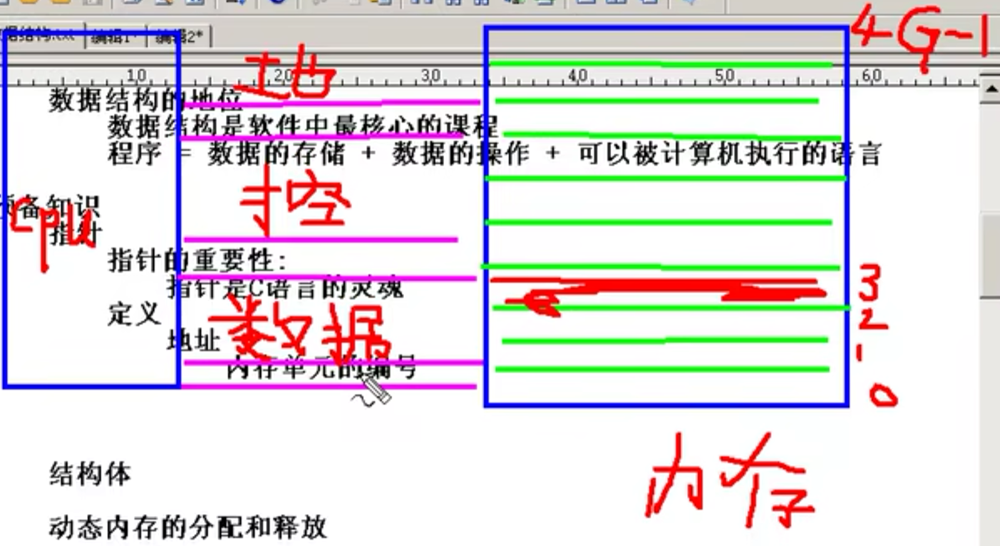
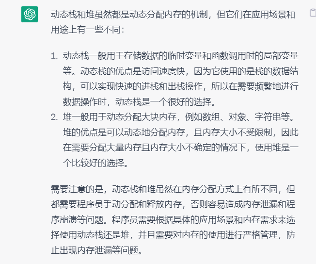

# 4.17 15点数据结构

## 模块一 线性结构


- java中容器和数据结构**相关知识**：

  ​	Iterator接口、	Map、	哈希表


## 数据结构概述

- **定义：** 如何把现实中大量而复杂的问题以特定的数据类型和特定的存储结构保存到主存储器

  ​		（内存）中，以及在此基础上为实现某个功能（比如查找某个元素，删除某个元素，对所有元素进行排序）而执行相应操作，这个相应的操作称为算法。

  - 特定的数据类型： 个体如何存储
  - 特定的存储结构： 个体间的关系   


**数据结构**： 个体 + 个体的关系

**算法：** 对存储数据的操作

​		解题方法和步骤

## **衡量算法的标准** 

- 时间复杂度  （程序执行的次数, 运行所需步骤 ）
- 空间复杂度 （算法执行过程中所占用的最大内存）
- 难易程度
- 健壮性


**数据结构的地位**： 是软件中**最核心**的课程 

- 程序： 数据的存储 + 数据的操作 + 可以被计算机执行的语言


**预备知识** ： 指针  结构体  动态内存的分配与释放

- [ ] 

- **地址线：** 找到所要进行处理的地址 (地址范围和机器的位数有关系，2的n次方)
- **控制线：** 操作的范围， 只读/ 只写 / 读并写
- **数据线：** 传入数据的方向， a-b / b-a


 


##   一维整型数组

a[0]:  a数组名表示 数组内第一个元素，所占字节数的首地址，但是在调用或使用时，*a == a[0] 会自动截取整个元素（获取其全部字节数），最终显示出**整个元素**


在32位的操作系统中： 一个指针变量（任意类型）的地址所占为4个字节

​	指针变量只存储所指向数据类型的地址（n个字节） 所占字节数第一个字节（8位）的地址

​		当使用此地址进行引用时，指针会自动识别该数据类型提取整个数据


## 指针数组和数组指针的概念

**指针数组**：指针数组是一个数组，是指由指针构成的数组，在这个数组中的所有元素都是指针，每个指针**占用相同**的字节

**数组指针**：数组指针是一个指针，是指一个数组的指针，数组两字表示这个指针指向一个数组的首地址，并且这个**指针加1时移动**的位置是整个数组的长度


## 指向数组的指针代码块及理解


​	**解决**: 内部的*号表示 获取整型数组第一个元素的地址，所以后面的+2，会**根据前面元素的类型** 变成加两个整型数据的字节数，所以变成第三个元素的地址，所以* ***内部**等于第三个元素的值

## 结构体的复习

```c++
#include<stdio.h>
#include<string.h>

struct Student{
	int sid;
	char name[200];
	int age;
};
//提前声明， main后定义了两个方法（在后面需要声明） 
void g(struct Student *pst);
void f(struct Student *pst);

int main(void){
	struct Student st = {100, "韩绝", 22};
	strcpy(st.name , "韩绝哥");
	printf("%d  %s %d \n", st.sid, st.name, st.age); 
	
	struct Student * pst;
	 pst = &st;
	 pst ->sid = 99;  //等价于 (*pst).sid 等价于 st.sod
//	 pst  指向结构体的成员 sid 

	struct Student st1; //未赋值， st1存储的为垃圾数值
	g(&st1);
	f(&st1);
	 
}

void g(struct Student * pst){
	(*pst).sid = 1998;
	strcpy(pst->name, "赵哥");
	(*pst).age = 20; 
} 
void f(struct Student * pst){
	printf("\n 为您输出赵哥的信息： %d %s %d \n", pst->sid, pst->name, pst->age);
}

```


# 4.18 	18：30

## 复习 malloc() 动态分配内存

 

​	

```C
#include<stdio.h>
#include<stdlib.h>
#include<malloc.h>
int main() {
	printf("请输入你要分配的整型数组长度： \n");
	int len ;
	scanf("%d", &len);

// 定义了一个整型指针  pArr, 其指向的为数组的第一元素
	int * pArr = (int*) malloc(sizeof(int) * len);
	for(int i=0; i< len; i++) {
		scanf(" %d", &pArr[i]);
	}

	for(int i=0; i<len; i++) {
		printf("数组中第%d个元素的值为：%d \n ",i+1, *(pArr+i));
	}
	free(pArr);
	return 0 ;
}

```

太久没写c语言： 在scanf中的输入时，填写了文本（“请输入第%d的数字”），导致在执行循环时，未报错，但是直接跳过输入的环节。

​	**scanf:** 内部只能存在占位符


# 4.19  中午  16点

## 结构体的使用-review

​		指向结构体的指针，不能直接.访问 ， 使用 **pst.age** ，来访问属性，会报错

​				如需使用: 必须先到达 地址 ,  （*p）.age ==  p->age

```C
#include<stdio.h>
#include<malloc.h>
#include<string.h>

struct Student{
	int age;
	char name[100];
};
struct Student *  CreateStudent();
void ShowStudent (struct Student* pst);

int main() {
	struct Student * ps;
	ps = CreateStudent();
	ShowStudent(ps);
	return 0;
}

struct Student *  CreateStudent() {
	struct Student * p = (struct Student*)malloc(sizeof(struct Student));

	p->age = 20;
	strcpy(p->name, "韩绝");
	return p;
}

void ShowStudent (struct Student* pst){
	printf("年龄为： %d, 姓名为 : %s", pst->age, pst->name);
}

#include<stdio.h>
#include<malloc.h>
#include<string.h>

struct Student{
	int age;
	char name[100];
};
struct Student *  CreateStudent();
void ShowStudent (struct Student* pst);

int main() {
	struct Student * ps;
	ps = CreateStudent();
	ShowStudent(ps);
	return 0;
}

struct Student *  CreateStudent() {
	struct Student * p = (struct Student*)malloc(sizeof(struct Student));

	p->age = 20;
	strcpy(p->name, "韩绝");
	return p;
}

void ShowStudent (struct Student* pst){
	printf("年龄为： %d, 姓名为 : %s", pst->age, pst->name);
}


```


## 模块1： 线性结构 （所有结点 由直线连接）

### 连续存储-【数组】

- ​	数组： 元素类型相等，大小相等


### 动态构造数组及数组内部方法（初始化、判断是否为空、元素遍历…）

```C
#include<stdio.h>
#include<malloc.h>
#include<stdbool.h>
#include <cstdlib>

struct Arr{
	int * pBase; //存储数组首元素的地址
	int len; // 数组容纳的最大元素的个数 
	int cnt; //当前数组有效元素个数 
//	int increment 自动增长因子， 拿空间换时间，提高效率 
// 举例： 插入1时会自动插入5的空间  需要用到动态扩充的知识 
};

void init_arr(struct Arr *pArr, int length);
bool is_empty(struct Arr * pArr);
void show_arr(struct Arr * pArr);

int main(){
	struct Arr arr;
	init_arr(&arr, 6); //将构造的数组 通过传地址 调用函数初始化 
	show_arr(&arr);
}

void init_arr(struct Arr *pArr, int length){
	pArr-> pBase = (int*) malloc (sizeof(int)* length);
		if(pArr->pBase == NULL){
			printf("报告赵哥，空间分配失败"); 
			exit(-1);
		}
	pArr->	len = length;
	pArr->  cnt = 0; 
}

bool is_empty(struct Arr * pArr){
	if(pArr-> cnt == NULL)
		return true;
	else
		return false;
} 

void show_arr(struct Arr * pArr){
	if(is_empty(pArr)){
		printf("数组元素个数为0，无法为您输出！ \n");
	}else{
		for(int i=0; i<(pArr->cnt); i++){
			printf("数组中第%d的元素为： %d", i+1, i); 
		}	
	}
	return ;
}


```


​	**exit(-1):  本程序终止**，需要导入头文件包： **#include <cstdlib>**		

​				课外知识： 终止： 终止不在继续		中止：可继续可终止


## C语言中 exit(0)  exit(非0) return区别


### 指定数组下标 插入元素


1.  确保插入时，数组元素容量>=1
2. 挪动时，从最后一个有效元素开始往右挪一位，直至将目标下标往右挪方可覆盖插入


### 代码块-构建数组-功能实现见程序 c-2


# 4.22	晚上23点

## 链表的重要性

​	


## typedef  起别名

int i = 30	； typedef  int  zhaog,  为int 起别名为 zhaog；   zhaog i = 20 == 定价了一个整型变量


定义了一个指针结构体数据类型， 并未其起别名为： PST == struct Student *

```C
#include<stdio.h>
#include<malloc.h>
#include<stdbool.h>
#include <cstdlib>
struct Arr{
	int * pBase; //存储数组首元素的地址
	int len; // 数组容纳的最大元素的个数 
	int cnt; //当前数组有效元素个数 
//	int increment 自动增长因子， 拿空间换时间，提高效率 
// 举例： 插入1时会自动插入5的空间  需要用到动态扩充的知识
};

void init_arr(struct Arr *pArr, int length);
bool is_empty(struct Arr * pArr);
bool is_full(struct Arr * pArr);
//倒置， 首尾互换 
void inversion_arr(struct Arr *pArr);
void show_arr(struct Arr * pArr);

bool reset_arr(struct Arr *pArr, int cnt,int var);
bool append_arr(struct Arr *pArr, int index);
bool insert_arr(struct Arr *pArr, int index,int var);
bool delete_arr(struct Arr *pArr, int index, int *p);

bool sort_arr(struct Arr *pArr);
//可视化 操作优化-- 生成数组 
int main(){
	int val;
	struct Arr arr;
	init_arr(&arr, 7); //将构造的数组 通过传地址 调用函数初始化 
	
	append_arr(&arr,1);
	append_arr(&arr,3);
	show_arr(&arr);
	reset_arr(&arr, 1, 5);
	append_arr(&arr,3);
	show_arr(&arr);
	
	insert_arr(&arr,3,15);
	show_arr(&arr);
	
	delete_arr(&arr,0,&val);
	show_arr(&arr);
	
	inversion_arr(&arr);
	show_arr(&arr);

	sort_arr(&arr);
	show_arr(&arr);
}

void init_arr(struct Arr *pArr, int length){
	pArr-> pBase = (int*) malloc (sizeof(int)* length);
		if(pArr->pBase == NULL){
			printf("报告赵哥，空间分配失败"); 
			exit(-1);
		}
	pArr->	len = length;
	pArr->  cnt = 0; 
}

//判断数组元素是否为空 
bool is_empty(struct Arr * pArr){
	if(pArr-> cnt == NULL)
		return true;
	else
		return false;
} 

//判断数组元素是否为满 
bool is_full(struct Arr * pArr){
	if(pArr-> cnt == pArr->len)
		return true;
	else
		return false;
} 

// 将数组元素输出 
void show_arr(struct Arr * pArr){
	printf(" \n   数组元素的个数为: %d \n", pArr->cnt); 
	if(is_empty(pArr)){
		printf("数组元素个数为0，无法为您输出！ \n");
	}else{
		for(int i=0; i<(pArr->cnt); i++){
			printf("数组中第%d的元素为： %d  \n", i+1, pArr->pBase[i] ); 
		}	
	}
	return ;
} 

// 从数组尾部 插入元素 
bool append_arr(struct Arr *pArr, int var){
		if(is_full(pArr)){
		printf("数组元素个数已满，无法添加 \n");
		return false;
	}else{
		pArr->pBase[pArr->cnt] = var;
		pArr->cnt++;
		return true;
	}
}

// 替换指定下标的元素 
bool reset_arr(struct Arr *pArr, int index,int var){

	if(pArr->cnt >= index+1 && !is_empty(pArr)){
		pArr->pBase[index] = var;
		return true;
		}
	else
		return false;

}

// 指定位置插入元素 
bool insert_arr(struct Arr *pArr, int index,int var) {
	if( !is_full(pArr) && pArr->cnt >= index){
		if(pArr->cnt == index ){
			pArr->pBase[index] = var;
			pArr->cnt++;	
			return true;
			}
		else{	
			if(index <0 ) exit(-1); 
		
			 
			
//		 此处初始时for循环用错， 从后往前， 所以应该是 判断条件应该是 >=继续执行，<退出循环 
				for(int i =1; pArr->cnt-i >= index; i++) {
				pArr->pBase[pArr->cnt] = pArr->pBase[pArr->cnt-i];
			}
		  	pArr->pBase[index] = var;
		  	pArr->cnt++;
		  	return true;
		} 
	}else
		return false;
	
}
//删除指定位置 
bool delete_arr(struct Arr *pArr, int index, int *p) {
//	cnt-1 为数组内最后一个元素的下标 
	if( !is_empty(pArr) && pArr->cnt-1 >= index){
		if(pArr->cnt-1 == index ){
			*p = pArr->pBase[index]; 
			pArr->cnt--;	
			printf("\n 删除的元素值为: %d", *p);
			return true;
			}
		else{	
			if(index <0 ) exit(-1); 
			   else
				for(int i = index; i < pArr->cnt-1; i++) {
					if(i == index) *p = pArr->pBase[index]; // 
					pArr->pBase[i] = pArr->pBase[i+1];
			}
		  	pArr->cnt--;
		  	printf("\n 删除的元素值为: %d", *p);
		  	return true;
		} 
	}else
		return false;
	
}

// 数组元素倒置 
void inversion_arr(struct Arr *pArr){
	int i = 0;
	int j = pArr->cnt-1;
	int t;
	while(i<j){
		t = pArr->pBase[i];
		pArr->pBase[i] = pArr->pBase[j];
		pArr->pBase[j] = t;
		i++;
		j--; 
	} 
	return; 
	
}

//选择排序 
bool sort_arr(struct Arr *pArr){
	int t;
	if(is_empty(pArr))
		return false; 
	else
//		for(int i=0; i<pArr->cnt-1; i++){
//			for(int j=i+1; j<pArr->cnt; j++){
//				if(pArr->pBase[i] > pArr->pBase[j]){
//					t = pArr->pBase[i];
//					pArr->pBase[i] = pArr->pBase[j]; 
//					pArr->pBase[j] = t;
//				}
//			
//			}
//	
//		}
        // 冒泡
			for(int i=0; i<pArr->cnt-1; i++){			
			for(int j=0; j<pArr->cnt-i-1; j++){
				if(pArr->pBase[j] > pArr-> pBase[j+1]){
					t = pArr->pBase[j];
					pArr->pBase[j] = pArr->pBase[j+1]; 
					pArr->pBase[j+1] = t;			

				}
			
			}
	
		}
	
		return true;	
}

```


**类比：** typedef int * I, J ， I == int *(整型指针类型)   J= Int


##   链表的定义

### 定义 

-  n个节点离散分配
- 彼此通过指针相连
- 每个节点只有一个前驱节点，每个节点只有一个后续节点
- 首节点没有前驱节点， 尾节点没有后续节点


### **专业术语**

- 首节点： 第一个有效节点

- 尾节点： 最后一个有效节点

- 头结点： 第一个有效节点之前的那个节点、  头结点不存放有效数据（其数据类型同首节点一样，所占空间-字节数，虽不存数据，但是所占空间大小与首节点一致）

  

  头指针： 指向头结点的指针变量

  尾指针： 指向尾节点的指针

  

   **加头结点的目的：** 主要是为了方便对链表的操作： 对首节点的操作同操作普通节点一样


**如果通过一个函数来获取一个链表的信息  最少只需要一个参数： 头指针**

​	头指针（只占四个字节），用头指针而不用头结点的原因（头节点的所占字节数同首节点一致）


### 链表节点

  需包含： 数据域和指针域

​	**指针域**： 指向一个同自己数据类型相同的另一个变量 


####  预备知识


## 链表分类

- 单链表
- 双链表：每一个节点有两个指针域： 双向指向
- 循环链表： 能通过任何一个节点找到其他所有的节点
- 非循环链表


## 算法

- 遍历
- 查找
- 清空
- 销毁
- 求长度
- 排序
- 删除节点
- 插入节点

 

### 链表中插入节点的方法


1. 将p->next ， p指向结构体的指针域赋值给r， 再将其覆盖为 p  -- 再赋予p节点的指针域指向
2. 原链表的节点赋予即将插入节点q的 指针域， 再将原链表节点的指针域覆盖为 q


###  删除节点


定义中间值r， 要对删除的节点进行删除（防止内存泄漏）


# 4.23 中午11：20

## 链表的创建及元素遍历-删除或添加指定位置节点

```C
#include<stdio.h>
#include<malloc.h>
#include<stdlib.h>

typedef struct Node{
	int data;
	struct Node * pNext; //指针域， 指向一个与自己同数据类型的的结构体
//	指向下一个节点 
} Node, *PNODE; // 结构体类型 Node, 结构体指针 PNODE

//函数声明 
PNODE create_List(); 
void traverse_list(PNODE pHead);
bool is_empty(PNODE pHead);
int length_list(PNODE pHead);
void sort_list(PNODE pHead);
bool insert_list(PNODE pHead, int pos, int val);
bool delete_list(PNODE pHead, int pos, int * p);

int main(){
	
	int val;
	PNODE pHead = NULL;
	pHead = create_List();
	traverse_list(pHead);
	
	if(!is_empty(pHead))
		printf("\n \n 链表节点长度为：%d \n", length_list(pHead));
	sort_list(pHead);
	traverse_list(pHead);
	
	insert_list(pHead, 1, 33);
	traverse_list(pHead);
	
	if(delete_list(pHead,1,&val)){
		printf("\n 删除成功- 删除的元素为： %d \n", val);
	}else printf("\n 删除失败！\n ");
	traverse_list(pHead);	
		
	return 0;
} 

PNODE create_List(){
	PNODE pHead = (PNODE) malloc(sizeof(Node));
	pHead->pNext = NULL; 
	
	PNODE pTail = pHead;
	int len, val;
	
	printf("请输入要构造链表的节点个数：len = ");
	scanf("%d", &len);
	
	 
	for(int i=0; i<len; i++){
		printf(" \n 请输入第%d节点的值: ", i+1);
		scanf("%d", &val);
		
		PNODE pNew = (PNODE)malloc(sizeof(Node));
		if(NULL == pNew){
			printf("分配失败，程序终止! \n");
			exit(-1);
		}
		pTail->pNext = pNew;
		pNew->data = val;
		pNew->pNext = NULL;
		pTail = pNew;
	}
	return pHead;
}
//遍历链表 
void traverse_list(PNODE pHead){
	printf("\n 赵哥，为您遍历链表内元素！ \n"); 
	PNODE p = pHead->pNext;
	while(p != NULL){
		printf("%d \t ",p->data);
		p = p->pNext;
	}
	return;
}

//链表是否为空 
bool is_empty(PNODE pHead){
	if(pHead->pNext!= NULL)
		return false;
	else
		return true;
} 
//链表长度 
int length_list(PNODE pHead){
	PNODE p = pHead->pNext;
	int len = 0;
	while(p != NULL){
		len++;
		p = p->pNext;
	}
	return len;
} 
//链表节点数据排序 
void sort_list(PNODE pHead){
	int i, j, t, len;
	len = length_list(pHead);
	PNODE p, q; 
//	for(i=0, p=pHead->pNext; i<len-1; i++, p=p->pNext)
//// 此行判断原写为： 选择排序 
//// j<len-1, 导致j最终只能到达 倒数第二个数，最后一个数不会被排序		
//		for(j=i+1 , q=p->pNext; j<len; j++, q=q->pNext)
//		{
//			if(p->data > q->data){ //类似于数组中的 a[i] > a[j] 
//				t = p->data; //类似于数组中的 t = a[i]  
//				p->data = q->data; //类似于数组中的 a[i] = a[j] 
//				q->data = t; //a[j] = t;
//			}
//		}
		
//	冒泡排序  首次出错为 未将首节点初始化赋值给p 
	for(i=0 ,p=pHead->pNext; i<len-1; i++, p=pHead->pNext)
	
		for(j=0 , q=p->pNext; j<len-i-1; j++, p=q, q=q->pNext)
		{
			if(p->data > q->data){ //类似于数组中的 a[i] > a[j] 
				t = p->data; //类似于数组中的 t = a[i]
				p->data = q->data; //类似于数组中的 a[i] = a[j] 
				q->data = t; //a[j] = t;
			}
		}
	return;		

}

//插入和删除节点，本质上为添加 /删除目标位置
// 在第pos节点前插入一个新的节点 
bool insert_list(PNODE pHead, int pos, int val){
	int i =0;
	PNODE  p = pHead;
	
//	此行代码为判断并 找到目标节点的前一个节点（pos-1） 
// p对应节点时，i对应第几个节点  pos(目标位置节点)
	while(NULL!=p && i<pos-1 ){
		p = p->pNext;
		i++;
	}
    //while 语句中 null等于p时跳出循环，说明目标位置已超过最大（目标位置的前一个位置 在 尾节点位置 之后）
	if(NULL==p || i>pos-1)
		return false;
	
	PNODE pNew = (PNODE)malloc(sizeof(Node));
	if(pNew == NULL){
		printf("动态内存分配失败，程序退出！ ");
		exit(-1); 
	} 
//	插入位置为 尾节点所处位置 +1时 
    // 如：节点数量为3， 所要插入的节点位置为4，只需要插在尾部即可 
	if(length_list(pHead) == pos-1){
		p->pNext = pNew;
		pNew->data = val;
		pNew->pNext = NULL;
		return true;
	}
	else{
		pNew->data = val;
		pNew->pNext = p->pNext;
		p->pNext = pNew;
		return true;		
	}
} 
bool delete_list(PNODE pHead, int pos, int * pVal){
	int i =0;
	PNODE  p = pHead;
//	此行代码为判断并 找到所要删除的节点位置前一个节点 
//  此判断条件表明需至少拥有一个节点，并且删除的节点范围需要在已拥有范围内 
	while(NULL!=p->pNext && i<pos-1){
		p = p->pNext;
		i++;
	}
	if(NULL==p->pNext || i>pos-1)
		return false;
	
	PNODE q = p->pNext;
	*pVal =  q->data;

// 删除元素为最后一个元素时 
	 if(length_list(pHead) == pos){
		p->pNext = NULL;
		free(q);
		q=NULL;
		return true; 
	} 
	else{
		p->pNext = p->pNext->pNext;
		free(q);
		q = NULL;
		return true; 
	}
	
}

```


PNODE pNew = (PNODE)malloc(sizeof(Node)) == struct Node  * pNew = (struct Node  *)malloc(sizeof(struct Node))

//定义了一个结构体 指针变量


## exit 函数


## 堆 栈 的异同


### 线性结构的两种常见应用之一 栈

- 定义 ：  一种可以实现“先进后出”的存储结构    栈类似于箱子 

- 分类：    静态栈    动态栈

- ### 静态栈和动态栈的实现方法


### 动态栈和堆的区别



### 栈- 算法

出栈 --  压栈 

### 栈程序演示

```c
#include<stdio.h>
#include<malloc.h>
#include<stdlib.h>

typedef struct Node {
	int data;
	struct Node *pNext;
} NODE, *PNODE;


//定义了一个栈
typedef struct Stack {
	PNODE pTop;
	PNODE pBottom;
} STACK, *PSTACK;

void init(PSTACK pS);
void push(PSTACK pS, int val);
void traverse(PSTACK pS);
bool is_empty(PSTACK pS);
bool pop(PSTACK pS, int *val);
void clear(PSTACK pS);


int main() {
	int val;
	STACK S;
	init(&S);
	push(&S, 5);
	push(&S, 3);
	push(&S, 1);
	traverse(&S);
	
	if(pop(&S, &val)){
		printf("\n 出栈成功， 元素数据为: %d \n", val);
	}else{
		printf("栈内无元素，出栈失败！");
	}

​	 clear(&S);
​	traverse(&S);

}
//对栈的初始化
void init(PSTACK pS) {
	pS->pBottom = (PNODE)malloc(sizeof(NODE));
	if(pS->pBottom == NULL) {
		printf("分配失败， 程序终止！\n");
		exit(-1);
	} else {
		pS->pTop = pS->pBottom;
		pS->pBottom->pNext = NULL;
	}
}
//元素 入栈 
void push(PSTACK pS, int val){
	PNODE pNew = (PNODE)malloc(sizeof(NODE));
	pNew->data = val;
	pNew->pNext = pS->pTop;
	pS->pTop = pNew;
}
//遍历 栈内元素数据 
void traverse(PSTACK pS){
	if(is_empty(pS)){
		printf("\n 栈为空，无法为您遍历栈内元素数据！\n");
		exit(-1);
	}else{
			PNODE p = pS->pTop;
			while(p != pS->pBottom){
				printf("%d \t", p->data);
				p = p->pNext;				
		} 
   }
}
//判断栈是否为空
bool is_empty(PSTACK pS){
	if(pS->pTop == pS->pBottom)
		return true;
	else
		return false;
}
//元素出栈 -释放资源 
bool pop(PSTACK pS, int *val) {
	if(is_empty(pS)){
		return false;
	}else{	
			PNODE p = pS->pTop;
			*val = p->data;
			pS->pTop = p->pNext;		
			free(p);
			p = NULL; 		
}
}

//清空栈内元素
void clear(PSTACK pS){
		if(is_empty(pS)){
		printf("栈内无元素，清空元素失败！");
		return ;
	}else{
		PNODE p = pS->pTop;
		while(p != pS->pBottom){
				p = pS->pTop->pNext;
				free(pS->pTop);
				pS->pTop = p; 
		}
			if(p == pS->pBottom)
			p == NULL;
		return;
	} 
}


```


### 栈应用于函数的调用

当程序调用f函数时， 函数的内部去调用g函数，被调用函数内部参数和返回地址都被存放在一个栈内，栈内的语句具有执行的信息，当函数被执行完时，资源得到释放


中断 - 表达式求值- 内存分配 - 缓冲处理 - 迷宫


## 算法

狭义的算法是与数据存储方式密切相关

广义的算法始于数据的存储方式无关 

泛型： 利用某种技术达到同种效果， 不同的存储方式，执行的操作是一样的


