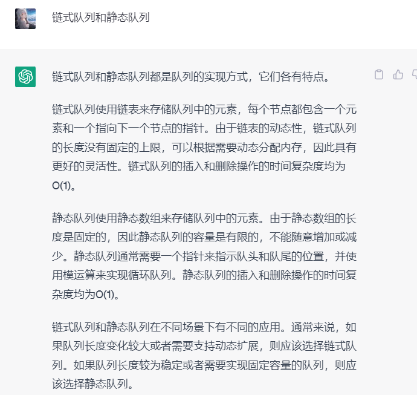
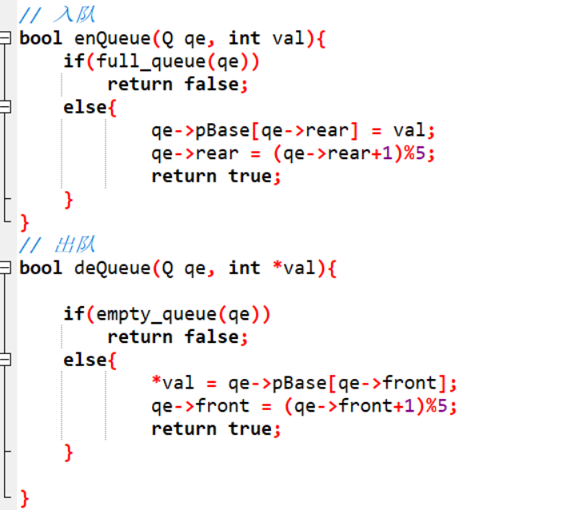

## 线性结构的两种常见应用之一： 队列

定义： 一种可以实现”先进先出“的存储结构 

​	无封口管道 （高压水流 ）（先进先出） 注入和流出 的方向 只能单一

### 分类： 链式队列和静态队列

队列具有两个指向（头指针指向： front  尾指针指向: rear）

### 链式队列： 用链表实现

#### 静态队列： 用数组表示

静态队列通常都必须是循环队列

## 循环队列的讲解：

1. 静态队列为什么必须是循环队列
2. 循环队列需要几个参数来确定
3. 循环队列各个参数的含义
4. 循环队列 入队伪算法讲解
5. 循环队列 出队伪算法讲解
6. 如何判断循环队列是否为空
7. 如何判断循环队列是否已满

# 4.24  15：30

### 模运算的目的

### 循环队列元素的最大个数为： maxSize -1

循环队列初始化时： 队头指针和队尾指针所指向的位置为同个位置（**队列为空**）

队头和队尾指针不会固定，随着进队出队，指针也会进行移动

**队头指针**： front指针所指向位置为第一个元素的位置

**队尾指针** :  rear指针所指向的位置： 最后一个元素的下一个**可用**位置，待插入位置

## 循环队列讲解- 视频-理解

2-

- 队列初始化：  **front**和**rear**的值都是0
- 队列非空： **front**指向队列第一个元素   **rear**代表的为最后一个有效元素的下一个元素位置
- 队列空： **front**和**rear**值相同， 但不一定等于0

4-**入队伪算法**

-  将值存入r代表的位置： r= (r+1) %数组长度

5-**出队伪算法**

-  front = (front+1) /数组长度

6- **判断循环队列是否为空**

-  **rear== front **  所以 数组最大值： maxSize -1 ,   如果为maxSize时，rear == front 产生歧义

7-如何判断循环队列为满

**预备知识**： front值 可能比rear大 小 /相等， 无规律性

- 两种方式： 

- 1. 定义一个标识参数 （定义一个函数 来记录存储的个数）  	

- 2. **少用一个元素，** 设置存入存入元素的最大长度值为： maxSize -1  ： 

     （两元素紧挨着 且满足以下判断条件，则队列已满 ）

     **C语言伪算法**

     if ( (r+1)%数组长度 == f ) 已满 ； else  不满;	

     

### 循环队列 龟壳表示

 

### 标识参数标志 实现循环队列已满

此标识参数- 代码相比于 少用一个数组元素的方法判断 是否满元素  较复杂

- ​	在定义循环结构体的时候： 定义了一个bool标识参数
  - 在初始格式化时，将 bool is_full定义为 false 
-   此参数每次调用 入队方法时，都会进行判断 rear == front (指向是否相同)，重合定义真
- 每次调用 出队都将  is_full 定义为  false - 出队意味着至少空余一个位置

### 标识参数构建循环列表 - 遍历方法

### 循环队列— 使用数组容量为： maxSize -1 创建 

详情见 e_1 文件

主要用到的知识点为： 空闲一个数组元素空间，使得判断 数组容量满时可使用--

**(rear+1)% length == front**,  不需要同标识参数样 在结构体定义一个 **标识参数**

###  队列的具体应用

- ​	所有和时间有关的操作都-- 都有队列的痕迹

## 递归

​	定义：	一个函数直接或间接调用自己

## 时间复杂度和空间复杂度

## 栈帧-- 调用程序时所使用的一段空间

### 举例

1.  1+2+3+…100和
2. 求阶乘 
3. 汉诺塔

